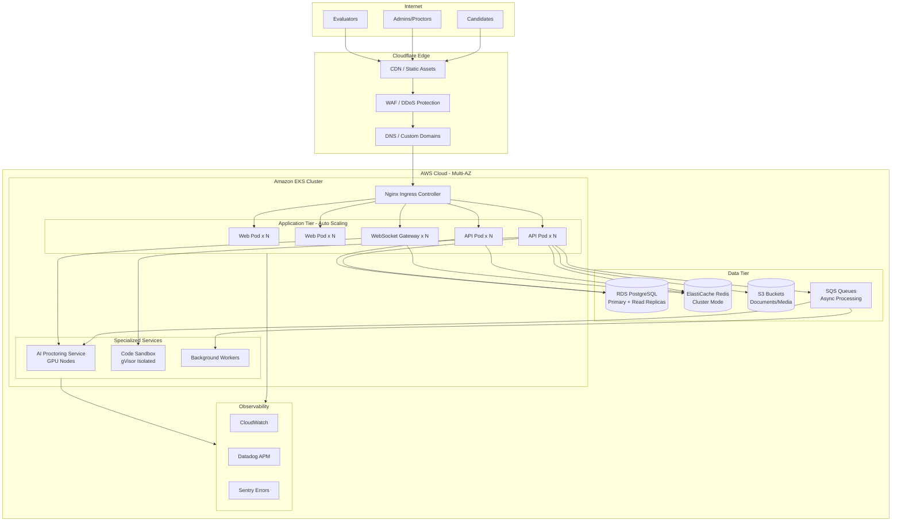
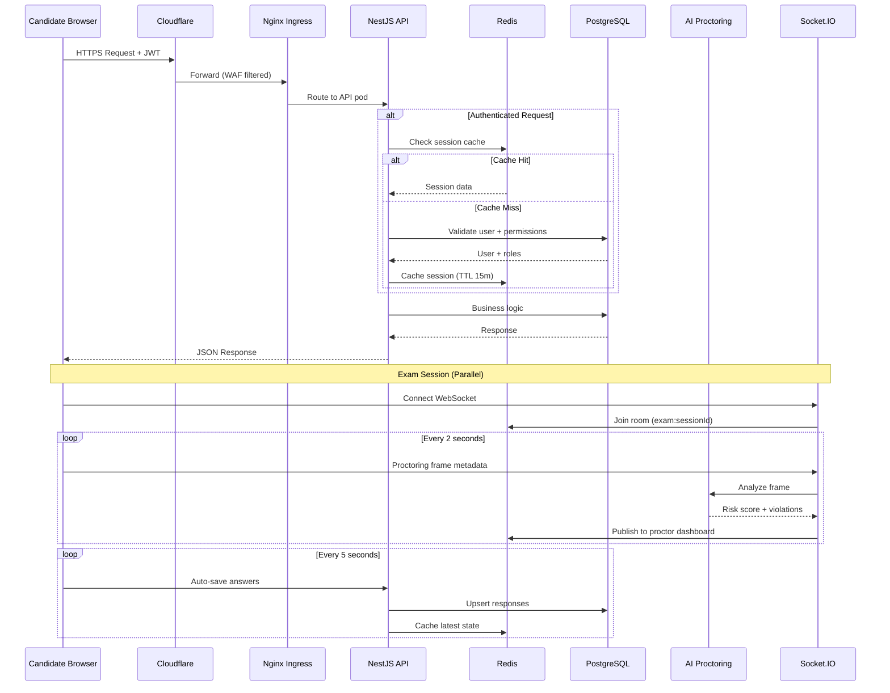
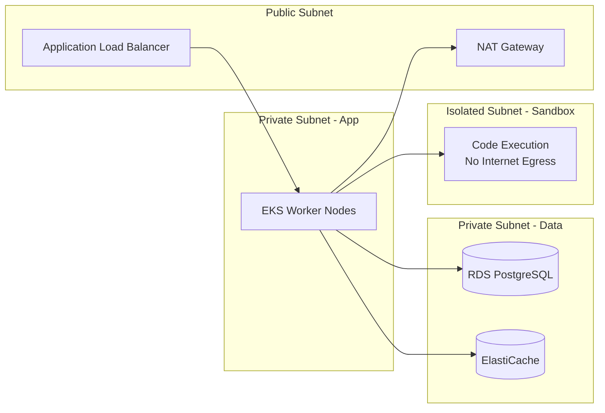
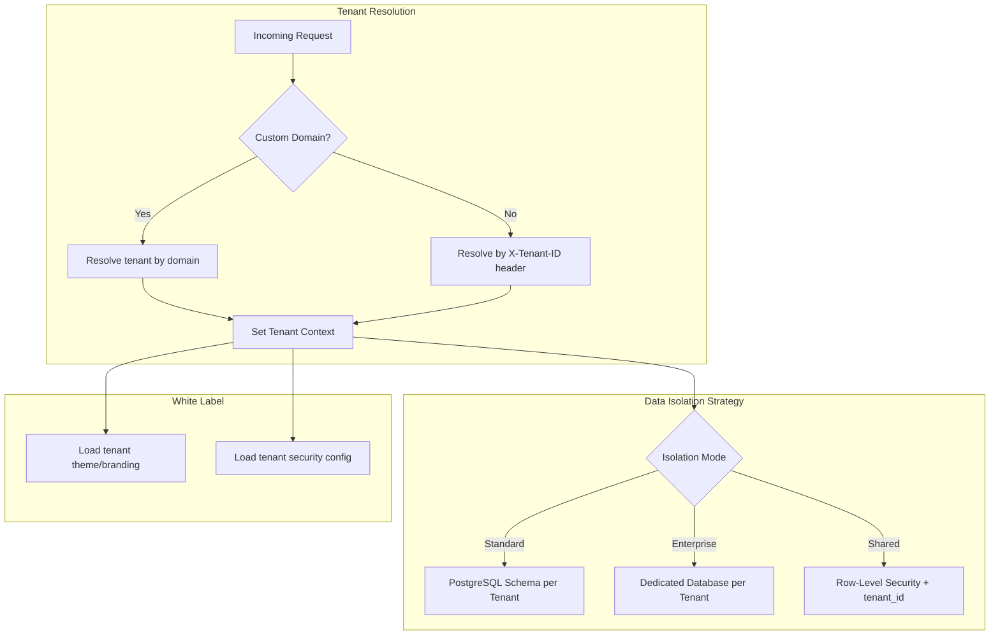

# 2. High-Level Architecture Diagram

## Production Deployment Topology

```mermaid
flowchart TB
    subgraph Internet
        CAND[Candidates]
        ADMIN[Admins/Proctors]
        EVAL[Evaluators]
    end

    subgraph Cloudflare["Cloudflare Edge"]
        CDN[CDN / Static Assets]
        WAF[WAF / DDoS Protection]
        DNS[DNS / Custom Domains]
    end

    subgraph AWS["AWS Cloud - Multi-AZ"]
        subgraph EKS["Amazon EKS Cluster"]
            ING[Nginx Ingress Controller]
            
            subgraph AppTier["Application Tier - Auto Scaling"]
                WEB1[Web Pod x N]
                WEB2[Web Pod x N]
                API1[API Pod x N]
                API2[API Pod x N]
                WS[WebSocket Gateway x N]
            end

            subgraph ServiceTier["Specialized Services"]
                AI[AI Proctoring Service<br/>GPU Nodes]
                CODE[Code Sandbox<br/>gVisor Isolated]
                WORKER[Background Workers]
            end
        end

        subgraph DataTier["Data Tier"]
            RDS[(RDS PostgreSQL<br/>Primary + Read Replicas)]
            REDIS[(ElastiCache Redis<br/>Cluster Mode)]
            S3[(S3 Buckets<br/>Documents/Media)]
            SQS[SQS Queues<br/>Async Processing]
        end

        subgraph Observability["Observability"]
            CW[CloudWatch]
            DD[Datadog APM]
            SENTRY[Sentry Errors]
        end
    end

    CAND --> CDN
    ADMIN --> CDN
    EVAL --> CDN
    CDN --> WAF
    WAF --> DNS
    DNS --> ING
    ING --> WEB1
    ING --> WEB2
    ING --> API1
    ING --> API2
    ING --> WS

    API1 --> RDS
    API2 --> RDS
    API1 --> REDIS
    API2 --> REDIS
    WS --> REDIS

    API1 --> SQS
    SQS --> WORKER
    SQS --> AI

    API1 --> S3
    WS --> AI
    API1 --> CODE

    AppTier --> Observability
    ServiceTier --> Observability
```

## Request Flow Diagram

```mermaid
sequenceDiagram
    participant C as Candidate Browser
    participant CF as Cloudflare
    participant NG as Nginx Ingress
    participant API as NestJS API
    participant R as Redis
    participant DB as PostgreSQL
    participant AI as AI Proctoring
    participant WS as Socket.IO

    C->>CF: HTTPS Request + JWT
    CF->>NG: Forward (WAF filtered)
    NG->>API: Route to API pod
    
    alt Authenticated Request
        API->>R: Check session cache
        alt Cache Hit
            R-->>API: Session data
        else Cache Miss
            API->>DB: Validate user + permissions
            DB-->>API: User + roles
            API->>R: Cache session (TTL 15m)
        end
    end

    API->>DB: Business logic
    DB-->>API: Response
    API-->>C: JSON Response

    Note over C,WS: Exam Session (Parallel)
    C->>WS: Connect WebSocket
    WS->>R: Join room (exam:sessionId)
    
    loop Every 2 seconds
        C->>WS: Proctoring frame metadata
        WS->>AI: Analyze frame
        AI-->>WS: Risk score + violations
        WS->>R: Publish to proctor dashboard
    end

    loop Every 5 seconds
        C->>API: Auto-save answers
        API->>DB: Upsert responses
        API->>R: Cache latest state
    end
```

## Network Segmentation

```mermaid
flowchart LR
    subgraph Public["Public Subnet"]
        ALB[Application Load Balancer]
        NAT[NAT Gateway]
    end

    subgraph Private["Private Subnet - App"]
        EKS_NODES[EKS Worker Nodes]
    end

    subgraph DataPrivate["Private Subnet - Data"]
        RDS_DB[(RDS PostgreSQL)]
        REDIS_CACHE[(ElastiCache)]
    end

    subgraph Isolated["Isolated Subnet - Sandbox"]
        SANDBOX[Code Execution<br/>No Internet Egress]
    end

    ALB --> EKS_NODES
    EKS_NODES --> RDS_DB
    EKS_NODES --> REDIS_CACHE
    EKS_NODES --> NAT
    EKS_NODES --> SANDBOX
```

## Multi-Tenant Data Isolation

```mermaid
flowchart TB
    subgraph TenantRouting["Tenant Resolution"]
        REQ[Incoming Request]
        REQ --> DOMAIN{Custom Domain?}
        DOMAIN -->|Yes| TD[Resolve tenant by domain]
        DOMAIN -->|No| TH[Resolve by X-Tenant-ID header]
        TD --> CTX[Set Tenant Context]
        TH --> CTX
    end

    subgraph Isolation["Data Isolation Strategy"]
        CTX --> MODE{Isolation Mode}
        MODE -->|Standard| SCHEMA[PostgreSQL Schema per Tenant]
        MODE -->|Enterprise| DB[Dedicated Database per Tenant]
        MODE -->|Shared| ROW[Row-Level Security + tenant_id]
    end

    subgraph Branding["White Label"]
        CTX --> THEME[Load tenant theme/branding]
        CTX --> CONFIG[Load tenant security config]
    end
```
