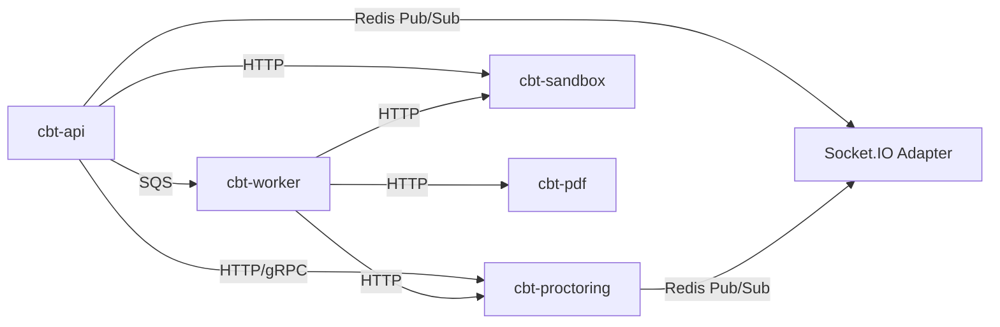

# 3. Microservices Breakdown

## Service Topology

The platform uses a **modular monolith** as the core with **extractable microservices** for specialized workloads. This enables single-deployment simplicity during development while supporting independent scaling in production.

## Service Catalog

| Service | Type | Responsibility | Scaling Trigger |
|---------|------|----------------|-----------------|
| **cbt-api** | Modular Monolith | Core business logic, REST, WebSocket gateway | CPU > 70%, RPS > 5K/pod |
| **cbt-web** | Frontend | Next.js SSR/CSR, exam client | CPU > 60% |
| **cbt-proctoring** | Microservice | Face detection, risk scoring, ML inference | GPU utilization > 80% |
| **cbt-sandbox** | Microservice | Isolated code execution | Queue depth > 100 |
| **cbt-worker** | Worker | Async jobs: evaluation, notifications, reports | Queue depth > 500 |
| **cbt-pdf** | Microservice | Admit cards, score cards, certificates | Queue depth > 50 |

## cbt-api (Core Monolith Modules)

```
cbt-api/
├── auth/                 # Authentication, MFA, sessions
├── tenants/              # Multi-tenant management
├── users/                # User management, profiles
├── candidates/           # Candidate lifecycle, KYC
├── questions/            # Question bank, versioning
├── exams/                # Exam creation, scheduling
├── exam-engine/          # CBT session management
├── proctoring/           # Proctoring orchestration (calls AI service)
├── security/             # Browser lockdown, violation tracking
├── coding/               # Coding assessment orchestration
├── results/              # Evaluation, ranking, publishing
├── analytics/            # Aggregated analytics
├── notifications/        # Email, SMS, push notifications
├── audit/                # Audit logging
└── health/               # Health checks, metrics
```

### Inter-Module Communication

- **Synchronous:** Direct module imports within monolith (NestJS DI)
- **Asynchronous:** Redis Streams / AWS SQS for cross-service events
- **Real-time:** Socket.IO with Redis adapter for horizontal scaling

## cbt-proctoring (AI Microservice)

**Runtime:** Python/FastAPI with ONNX Runtime (GPU-accelerated)

```
cbt-proctoring/
├── detectors/
│   ├── face_detector.py       # MTCNN / RetinaFace
│   ├── face_verifier.py       # ArcFace embedding comparison
│   ├── multi_face.py          # Multiple person detection
│   ├── eye_tracker.py         # Gaze estimation
│   ├── head_pose.py           # Head orientation
│   ├── phone_detector.py      # Mobile phone YOLO
│   └── audio_analyzer.py      # Background noise classification
├── scoring/
│   ├── risk_engine.py         # Weighted risk score aggregation
│   └── violation_classifier.py
├── api/
│   ├── analyze_frame.py       # POST /analyze/frame
│   ├── verify_identity.py     # POST /verify/identity
│   └── batch_analyze.py       # POST /analyze/batch
└── models/                    # Pre-trained ONNX models
```

**API Contract:**
```json
POST /analyze/frame
{
  "sessionId": "uuid",
  "candidateId": "uuid",
  "frameBase64": "...",
  "timestamp": "ISO8601",
  "metadata": { "tabVisible": true, "fullscreen": true }
}

Response:
{
  "riskScore": 23,
  "violations": [
    { "type": "MULTIPLE_FACES", "confidence": 0.92, "severity": "HIGH" }
  ],
  "faceMatch": { "verified": true, "confidence": 0.97 },
  "eyeTracking": { "lookingAway": false, "gazeDeviation": 12 }
}
```

## cbt-sandbox (Code Execution Microservice)

**Runtime:** Node.js with gVisor/Docker isolation

```
cbt-sandbox/
├── runners/
│   ├── java.runner.ts
│   ├── python.runner.ts
│   ├── javascript.runner.ts
│   ├── cpp.runner.ts
│   ├── csharp.runner.ts
│   └── go.runner.ts
├── sandbox/
│   ├── container.pool.ts      # Pre-warmed container pool
│   ├── resource.limits.ts     # CPU, memory, time limits
│   └── security.policy.ts     # No network, read-only FS
└── api/
    └── execute.ts             # POST /execute
```

**Security Constraints:**
- No network access
- 256MB memory limit
- 10s CPU time limit
- Read-only filesystem except /tmp
- Seccomp profile restricting syscalls

## cbt-worker (Background Jobs)

| Job Type | Queue | Priority | Concurrency |
|----------|-------|----------|-------------|
| `evaluate.exam` | evaluation | HIGH | 50 |
| `generate.admit-card` | documents | MEDIUM | 20 |
| `generate.certificate` | documents | MEDIUM | 20 |
| `send.notification` | notifications | MEDIUM | 100 |
| `aggregate.analytics` | analytics | LOW | 10 |
| `detect.plagiarism` | coding | HIGH | 20 |
| `bulk.import.questions` | import | LOW | 5 |

## Service Discovery & Communication



## Event Bus Schema

```typescript
// Domain events published to Redis Streams / SQS
interface DomainEvent {
  id: string;
  type: string;
  tenantId: string;
  aggregateId: string;
  aggregateType: string;
  payload: Record<string, unknown>;
  metadata: {
    userId?: string;
    correlationId: string;
    timestamp: string;
    version: number;
  };
}

// Key event types
type EventType =
  | 'exam.session.started'
  | 'exam.session.submitted'
  | 'proctoring.violation.detected'
  | 'proctoring.risk.threshold.exceeded'
  | 'candidate.registered'
  | 'result.published'
  | 'question.approved'
  | 'audit.security.violation';
```

## Deployment Units (Kubernetes)

| Deployment | Replicas (min) | Replicas (max) | Resources |
|------------|----------------|----------------|-----------|
| cbt-api | 3 | 100 | 1 CPU, 2Gi |
| cbt-web | 2 | 50 | 0.5 CPU, 1Gi |
| cbt-proctoring | 2 | 30 | 2 CPU, 4Gi, 1 GPU |
| cbt-sandbox | 2 | 20 | 1 CPU, 512Mi |
| cbt-worker | 2 | 30 | 1 CPU, 1Gi |
