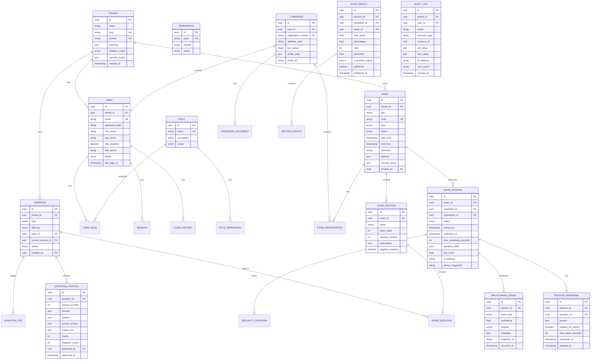

# 4. Database Schema

## Entity Relationship Diagram



## Indexing Strategy

### Primary Indexes (B-tree)

```sql
-- High-frequency lookup paths
CREATE INDEX idx_users_tenant_email ON users(tenant_id, email);
CREATE INDEX idx_candidates_registration ON candidates(registration_number);
CREATE INDEX idx_exam_sessions_active ON exam_sessions(exam_id, status) WHERE status = 'IN_PROGRESS';
CREATE INDEX idx_session_responses_session ON session_responses(session_id, question_id);
CREATE INDEX idx_proctoring_events_session_time ON proctoring_events(session_id, occurred_at DESC);
CREATE INDEX idx_audit_logs_tenant_time ON audit_logs(tenant_id, created_at DESC);
CREATE INDEX idx_exam_registrations_exam ON exam_registrations(exam_id, candidate_id);
CREATE INDEX idx_questions_tenant_type_status ON questions(tenant_id, type, status);
```

### Composite Indexes

```sql
-- Multi-column for common query patterns
CREATE INDEX idx_exam_sessions_candidate_exam ON exam_sessions(candidate_id, exam_id, status);
CREATE INDEX idx_results_exam_rank ON exam_results(exam_id, rank) WHERE published = true;
CREATE INDEX idx_login_history_user_time ON login_history(user_id, created_at DESC);
```

### Full-Text Search

```sql
-- Question bank search
CREATE INDEX idx_questions_fts ON questions 
  USING gin(to_tsvector('english', coalesce(title, '') || ' ' || coalesce(description, '')));

-- Audit log search
CREATE INDEX idx_audit_fts ON audit_logs 
  USING gin(to_tsvector('english', action || ' ' || resource_type));
```

### Partial Indexes

```sql
-- Active sessions only (hot data)
CREATE INDEX idx_active_sessions ON exam_sessions(exam_id, candidate_id) 
  WHERE status IN ('IN_PROGRESS', 'PAUSED');

-- Pending evaluations
CREATE INDEX idx_pending_evaluations ON exam_results(exam_id) 
  WHERE evaluation_status = 'PENDING';
```

## Partitioning Strategy

### Time-Based Partitioning

```sql
-- Proctoring events: partition by month (high volume)
CREATE TABLE proctoring_events (
    id UUID NOT NULL,
    session_id UUID NOT NULL,
    event_type VARCHAR(50) NOT NULL,
    occurred_at TIMESTAMPTZ NOT NULL,
    -- ... other columns
    PRIMARY KEY (id, occurred_at)
) PARTITION BY RANGE (occurred_at);

CREATE TABLE proctoring_events_2026_06 PARTITION OF proctoring_events
    FOR VALUES FROM ('2026-06-01') TO ('2026-07-01');

-- Audit logs: partition by quarter
CREATE TABLE audit_logs (
    id UUID NOT NULL,
    tenant_id UUID NOT NULL,
    created_at TIMESTAMPTZ NOT NULL,
    -- ... other columns
    PRIMARY KEY (id, created_at)
) PARTITION BY RANGE (created_at);

-- Session responses: partition by exam_id hash (exam-day sharding)
CREATE TABLE session_responses (
    id UUID NOT NULL,
    session_id UUID NOT NULL,
    exam_id UUID NOT NULL,
    -- ... other columns
    PRIMARY KEY (id, exam_id)
) PARTITION BY HASH (exam_id);
```

### Partition Management

- Automated partition creation via pg_partman extension
- Retention: proctoring events 90 days, audit logs 7 years
- Archive to S3 via logical replication + AWS DMS

## Backup Strategy

| Component | Method | Frequency | Retention |
|-----------|--------|-----------|-----------|
| PostgreSQL | RDS automated snapshots | Daily | 35 days |
| PostgreSQL | Point-in-time recovery | Continuous (WAL) | 35 days |
| PostgreSQL | Cross-region snapshot copy | Daily | 90 days |
| Redis | RDB snapshots + AOF | Hourly RDB, continuous AOF | 7 days |
| S3 Documents | Versioning + Cross-region replication | Continuous | Per tenant policy |
| Application state | Velero K8s backup | Daily | 30 days |

### Recovery Procedures

1. **RPO < 1 min:** WAL streaming to standby replica
2. **RTO < 15 min:** Automated failover to read replica (RDS Multi-AZ)
3. **Disaster recovery:** Cross-region restore from snapshot (< 1 hour)
4. **Exam-day protection:** Pre-exam snapshot + read replica promotion playbook

## Connection Pooling

```
Application → PgBouncer (transaction mode) → PostgreSQL
  - Pool size: 100 per API pod
  - Max connections: 5000 (with 50 API pods)
  - Read replicas: 3 (round-robin via Prisma read replica extension)
```
