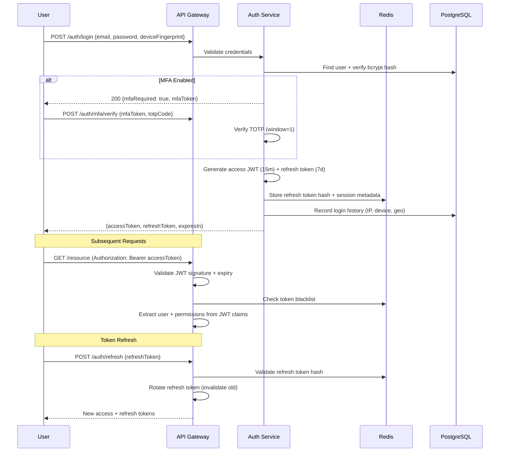

# 9. Security Architecture

## Defense-in-Depth Model

```
┌─────────────────────────────────────────────────────────────┐
│ Layer 1: PERIMETER (Cloudflare WAF, DDoS, Bot Management)  │
├─────────────────────────────────────────────────────────────┤
│ Layer 2: TRANSPORT (TLS 1.3, HSTS, Certificate Pinning)    │
├─────────────────────────────────────────────────────────────┤
│ Layer 3: APPLICATION (JWT, RBAC, Input Validation, CSRF)   │
├─────────────────────────────────────────────────────────────┤
│ Layer 4: DATA (AES-256 Encryption, Row-Level Security)     │
├─────────────────────────────────────────────────────────────┤
│ Layer 5: EXAM (Browser Lockdown, Proctoring, Watermark)    │
├─────────────────────────────────────────────────────────────┤
│ Layer 6: MONITORING (Audit Logs, SIEM, Anomaly Detection)   │
└─────────────────────────────────────────────────────────────┘
```

## OWASP Top 10 Mitigations

| OWASP Risk | Mitigation |
|------------|------------|
| **A01: Broken Access Control** | RBAC guards on every endpoint, tenant isolation middleware, resource ownership validation |
| **A02: Cryptographic Failures** | AES-256-GCM for PII at rest, TLS 1.3 in transit, bcrypt (cost 12) for passwords, secrets in AWS Secrets Manager |
| **A03: Injection** | Prisma parameterized queries, class-validator DTOs, Content-Type validation |
| **A04: Insecure Design** | Threat modeling per module, security review gate in PR process |
| **A05: Security Misconfiguration** | Hardened Docker images, K8s Pod Security Standards (restricted), automated config scanning |
| **A06: Vulnerable Components** | Dependabot, Snyk scanning in CI, monthly dependency audit |
| **A07: Auth Failures** | MFA mandatory for admin roles, refresh token rotation, account lockout (5 attempts), device fingerprinting |
| **A08: Data Integrity** | HMAC-signed exam responses, immutable audit logs, question version checksums |
| **A09: Logging Failures** | Structured JSON audit logs, centralized SIEM, tamper-proof log storage |
| **A10: SSRF** | URL allowlist for webhooks, no user-controlled server-side requests |

## Authentication Flow



## Encryption Strategy

### At Rest

| Data Type | Algorithm | Key Management |
|-----------|-----------|----------------|
| Passwords | bcrypt (cost 12) | N/A (one-way) |
| PII (Aadhaar, etc.) | AES-256-GCM | AWS KMS per-tenant DEK |
| MFA Secrets | AES-256-GCM | AWS KMS |
| Exam Responses | AES-256-GCM | Session-specific key |
| Documents (S3) | SSE-KMS | AWS KMS |
| Database (RDS) | AES-256 | AWS managed key |

### In Transit

- TLS 1.3 minimum for all connections
- Certificate pinning in exam client
- mTLS between internal services (Istio service mesh)
- WebSocket connections over WSS only

## Exam Security Controls

### Browser Lockdown

```typescript
// Client-side security enforcement
interface ExamSecurityPolicy {
  fullscreen: boolean;           // Force fullscreen mode
  blockCopyPaste: boolean;         // Disable clipboard
  blockRightClick: boolean;        // Disable context menu
  blockPrint: boolean;             // Disable print (CSS + JS)
  detectDevTools: boolean;         // Monitor window dimensions
  detectScreenCapture: boolean;    // getDisplayMedia monitoring
  detectVirtualMachine: boolean;   // WebGL renderer check
  detectMultipleMonitors: boolean; // Screen count check
  watermark: {
    enabled: boolean;
    content: 'candidateId' | 'email' | 'custom';
    opacity: number;
  };
  allowedBrowsers: ('chrome' | 'firefox' | 'edge')[];
  sebConfigKey?: string;          // Safe Exam Browser config
}
```

### Violation Detection & Response

| Violation | Detection Method | Severity | Auto-Response |
|-----------|-----------------|----------|---------------|
| Tab switch | `visibilitychange` event | MEDIUM | Warning + log |
| Copy attempt | `copy` event blocked | HIGH | Warning + log |
| DevTools open | Window size threshold | HIGH | Alert proctor |
| Multiple faces | AI proctoring | CRITICAL | Alert + flag |
| VPN detected | IP intelligence API | HIGH | Block login |
| VM detected | WebGL fingerprint | HIGH | Block exam start |
| Screen share | getDisplayMedia | CRITICAL | Terminate session |

## Rate Limiting

```typescript
// Tiered rate limits per endpoint category
const rateLimits = {
  auth: { ttl: 60, limit: 10 },        // 10 login attempts/min
  api: { ttl: 60, limit: 100 },         // 100 requests/min
  exam: { ttl: 60, limit: 30 },         // 30 saves/min during exam
  proctoring: { ttl: 60, limit: 60 },   // 60 frames/min
  upload: { ttl: 300, limit: 10 },      // 10 uploads/5min
};
```

## Audit Logging

Every security-relevant action is logged:

```typescript
interface AuditLogEntry {
  id: string;
  tenantId: string;
  userId: string;
  action: string;           // e.g., 'auth.login', 'exam.session.start'
  resourceType: string;     // e.g., 'ExamSession', 'User'
  resourceId: string;
  oldValue?: Record<string, unknown>;
  newValue?: Record<string, unknown>;
  ipAddress: string;
  userAgent: string;
  deviceFingerprint: string;
  geoLocation?: { country: string; city: string };
  severity: 'INFO' | 'WARNING' | 'CRITICAL';
  createdAt: string;
}
```

**Immutable storage:** Audit logs written to append-only PostgreSQL partition + streamed to S3 for long-term archival. No UPDATE or DELETE operations permitted on audit tables.

## Compliance Readiness

### GDPR

- [ ] Data Processing Agreement (DPA) per tenant
- [ ] Right to erasure (candidate data deletion workflow)
- [ ] Data portability (export API)
- [ ] Consent management for biometric data (face photos)
- [ ] Data retention policies per tenant
- [ ] Privacy Impact Assessment (PIA) for AI proctoring

### ISO 27001

- [ ] Information Security Management System (ISMS)
- [ ] Risk assessment methodology
- [ ] Access control policy (RBAC implementation)
- [ ] Incident response plan
- [ ] Business continuity plan (exam-day playbook)
- [ ] Supplier security assessment

### SOC 2

- [ ] Security monitoring and alerting
- [ ] Change management (CI/CD with approvals)
- [ ] Logical access controls (RBAC + MFA)
- [ ] System operations (automated backups, patching)
- [ ] Availability monitoring (99.99% SLA)

## IP & Geofencing

```typescript
interface GeoPolicy {
  allowedCountries: string[];     // ISO 3166-1 alpha-2
  blockedCountries: string[];
  allowedIpRanges: string[];      // CIDR notation
  blockedIpRanges: string[];
  vpnDetection: boolean;
  proxyDetection: boolean;
  torDetection: boolean;
}
```

IP intelligence via MaxMind GeoIP2 + IPQualityScore for VPN/proxy detection.
