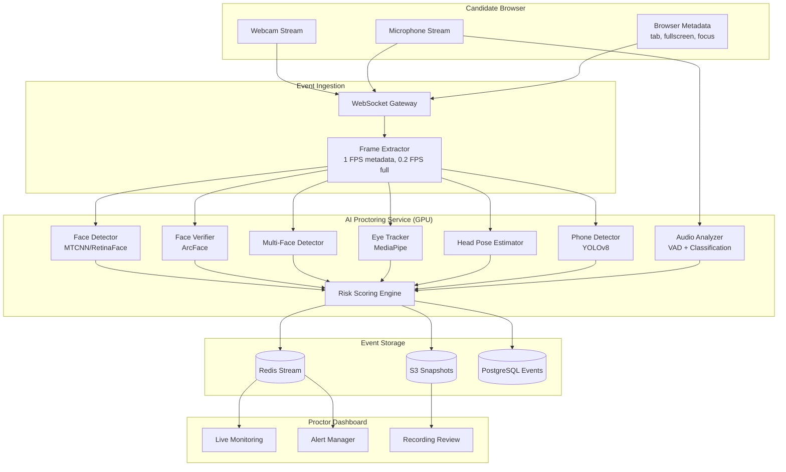
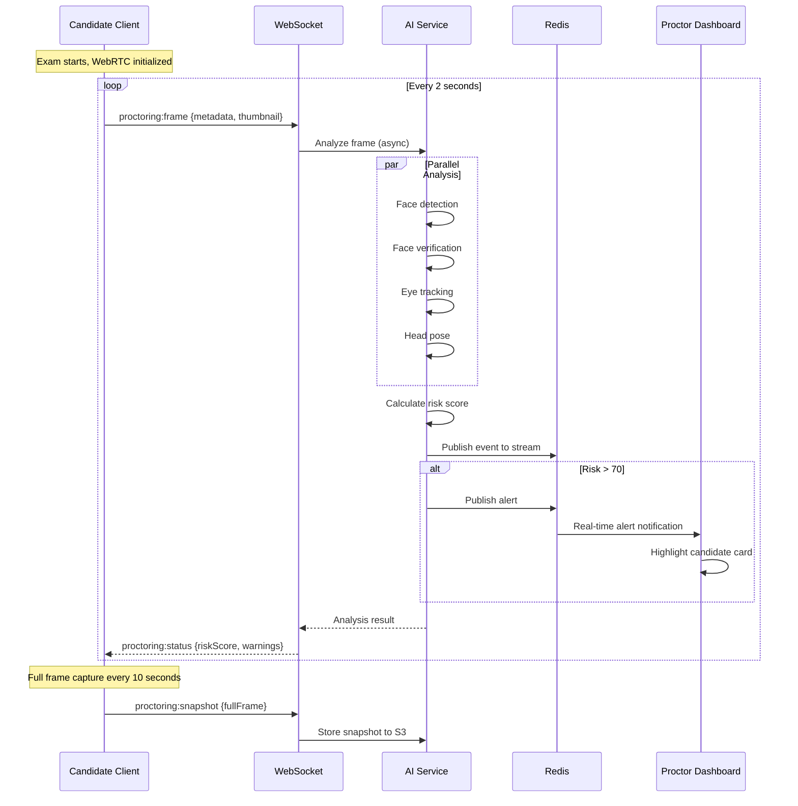

# 10. AI Proctoring Architecture

## System Overview



## Risk Scoring Engine

### Score Components

| Component | Weight | Range | Description |
|-----------|--------|-------|-------------|
| Face Presence | 20% | 0-100 | No face detected in frame |
| Face Match | 25% | 0-100 | Identity verification confidence |
| Multiple Faces | 20% | 0-100 | More than one person detected |
| Eye Tracking | 15% | 0-100 | Gaze deviation from screen |
| Head Pose | 10% | 0-100 | Head turned away from screen |
| Audio Anomaly | 5% | 0-100 | Background voices, suspicious sounds |
| Phone Detection | 5% | 0-100 | Mobile phone in frame |

### Risk Score Calculation

```python
def calculate_risk_score(components: dict) -> float:
    weights = {
        'face_presence': 0.20,
        'face_match': 0.25,
        'multiple_faces': 0.20,
        'eye_tracking': 0.15,
        'head_pose': 0.10,
        'audio_anomaly': 0.05,
        'phone_detection': 0.05,
    }
    
    score = sum(
        components[key] * weights[key]
        for key in weights
    )
    
    # Apply temporal smoothing (EMA)
    return ema_smooth(score, alpha=0.3)
```

### Threshold Actions

| Risk Score | Level | Action |
|------------|-------|--------|
| 0-30 | LOW | Normal monitoring |
| 31-50 | MEDIUM | Log event, increase snapshot frequency |
| 51-70 | HIGH | Alert proctor, warning to candidate |
| 71-85 | CRITICAL | Proctor intervention required |
| 86-100 | SEVERE | Auto-flag for review, optional auto-terminate |

## Detection Models

### Face Detection & Verification Pipeline

```
Input Frame (640x480)
    │
    ▼
Face Detection (RetinaFace) ──→ Bounding boxes
    │
    ├── 0 faces → violation: NO_FACE (score: 100)
    ├── 1 face  → continue pipeline
    └── 2+ faces → violation: MULTIPLE_FACES (score: 95)
    │
    ▼
Face Alignment (5-point landmarks)
    │
    ▼
Embedding Extraction (ArcFace, 512-dim)
    │
    ▼
Cosine Similarity vs. Reference Photo
    │
    ├── similarity < 0.70 → violation: FACE_MISMATCH (score: 90)
    ├── similarity 0.70-0.85 → warning: LOW_CONFIDENCE (score: 50)
    └── similarity > 0.85 → verified ✓
```

### Eye Tracking

```python
class EyeTracker:
    def analyze(self, frame, face_landmarks):
        left_eye = extract_eye_region(frame, landmarks, 'left')
        right_eye = extract_eye_region(frame, landmarks, 'right')
        
        gaze_vector = estimate_gaze(left_eye, right_eye)
        deviation_angle = angle_from_screen_normal(gaze_vector)
        
        return {
            'lookingAway': deviation_angle > 30,
            'gazeDeviation': deviation_angle,
            'eyesClosed': detect_blink(left_eye, right_eye),
            'score': min(deviation_angle / 45 * 100, 100)
        }
```

## Real-Time Processing Flow



## Client-Side Integration

```typescript
// Exam proctoring client module
class ProctoringClient {
  private mediaStream: MediaStream;
  private frameInterval: number = 2000; // 2 seconds
  private snapshotInterval: number = 10000; // 10 seconds
  private riskScore: number = 0;

  async initialize(referencePhotoUrl: string): Promise<void> {
    this.mediaStream = await navigator.mediaDevices.getUserMedia({
      video: { width: 640, height: 480, facingMode: 'user' },
      audio: true,
    });
    
    // Pre-exam identity verification
    const verified = await this.verifyIdentity(referencePhotoUrl);
    if (!verified) throw new ProctoringError('IDENTITY_VERIFICATION_FAILED');
    
    this.startFrameCapture();
    this.startBrowserMonitoring();
  }

  private startBrowserMonitoring(): void {
    document.addEventListener('visibilitychange', () => {
      this.emitEvent('TAB_SWITCH', { visible: !document.hidden });
    });
    
    window.addEventListener('blur', () => {
      this.emitEvent('WINDOW_BLUR', {});
    });
    
    // Fullscreen enforcement
    if (!document.fullscreenElement) {
      document.documentElement.requestFullscreen();
    }
  }

  private async captureAndAnalyze(): Promise<void> {
    const canvas = this.captureFrame();
    const thumbnail = canvas.toDataURL('image/jpeg', 0.5);
    
    this.socket.emit('proctoring:frame', {
      sessionId: this.sessionId,
      thumbnail,
      timestamp: new Date().toISOString(),
      metadata: {
        tabVisible: !document.hidden,
        fullscreen: !!document.fullscreenElement,
        focused: document.hasFocus(),
      },
    });
  }
}
```

## Proctor Dashboard Features

- **Grid View:** All active candidates with live risk score indicators
- **Alert Feed:** Real-time violation stream sorted by severity
- **Candidate Detail:** Live video feed, violation timeline, risk score graph
- **Intervention Actions:** Send warning, pause exam, terminate session
- **Recording Review:** Post-exam playback with violation markers

## Privacy & Compliance

- Biometric data (face embeddings) encrypted at rest with tenant-specific keys
- Face embeddings deleted 90 days after exam completion (configurable)
- Candidate consent required before proctoring activation
- Proctoring can be disabled per exam (configurable security policy)
- GDPR right to erasure includes all proctoring data

## Performance Targets

| Metric | Target | Strategy |
|--------|--------|----------|
| Frame analysis latency | < 500ms | GPU batching, ONNX Runtime |
| Concurrent streams | 100K+ | Horizontal pod autoscaling |
| Model inference | < 200ms | TensorRT optimization |
| Event delivery | < 100ms | Redis Streams |
| Snapshot storage | < 1s | Async S3 upload |
