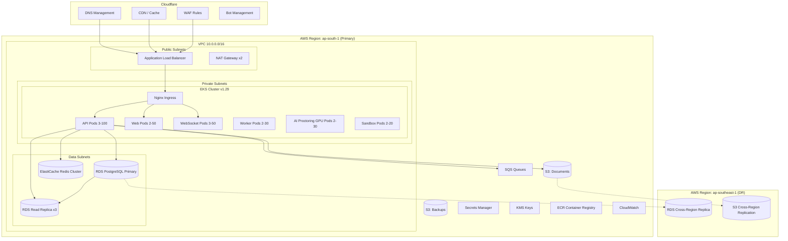

# 13. Deployment Architecture

## AWS Infrastructure



## Kubernetes Architecture

### Namespace Layout

```yaml
namespaces:
  - cbt-production      # Application workloads
  - cbt-staging         # Staging environment
  - cbt-monitoring      # Prometheus, Grafana
  - cbt-logging         # Fluentd, Elasticsearch
  - ingress-nginx       # Ingress controller
  - cert-manager        # TLS certificates
```

### Resource Specifications

```yaml
# API Deployment
apiVersion: apps/v1
kind: Deployment
metadata:
  name: cbt-api
  namespace: cbt-production
spec:
  replicas: 3
  strategy:
    type: RollingUpdate
    rollingUpdate:
      maxSurge: 25%
      maxUnavailable: 0
  template:
    spec:
      containers:
        - name: api
          image: <ecr>/cbt-api:latest
          resources:
            requests:
              cpu: 500m
              memory: 1Gi
            limits:
              cpu: 2000m
              memory: 2Gi
          ports:
            - containerPort: 4000
          livenessProbe:
            httpGet:
              path: /health
              port: 4000
            initialDelaySeconds: 30
            periodSeconds: 10
          readinessProbe:
            httpGet:
              path: /health/ready
              port: 4000
            initialDelaySeconds: 5
            periodSeconds: 5
          envFrom:
            - secretRef:
                name: cbt-api-secrets
            - configMapRef:
                name: cbt-api-config
```

### Horizontal Pod Autoscaler

```yaml
apiVersion: autoscaling/v2
kind: HorizontalPodAutoscaler
metadata:
  name: cbt-api-hpa
spec:
  scaleTargetRef:
    apiVersion: apps/v1
    kind: Deployment
    name: cbt-api
  minReplicas: 3
  maxReplicas: 100
  metrics:
    - type: Resource
      resource:
        name: cpu
        target:
          type: Utilization
          averageUtilization: 70
    - type: Resource
      resource:
        name: memory
        target:
          type: Utilization
          averageUtilization: 80
  behavior:
    scaleUp:
      stabilizationWindowSeconds: 60
      policies:
        - type: Percent
          value: 50
          periodSeconds: 60
    scaleDown:
      stabilizationWindowSeconds: 300
      policies:
        - type: Percent
          value: 10
          periodSeconds: 60
```

## Nginx Ingress Configuration

```nginx
# Rate limiting zones
limit_req_zone $binary_remote_addr zone=auth:10m rate=10r/m;
limit_req_zone $binary_remote_addr zone=api:10m rate=100r/m;
limit_req_zone $binary_remote_addr zone=exam:10m rate=30r/m;

server {
    listen 443 ssl http2;
    server_name *.cbt-platform.com;

    ssl_certificate /etc/ssl/cbt-platform.crt;
    ssl_certificate_key /etc/ssl/cbt-platform.key;
    ssl_protocols TLSv1.2 TLSv1.3;

    # Security headers
    add_header Strict-Transport-Security "max-age=31536000; includeSubDomains" always;
    add_header X-Content-Type-Options nosniff always;
    add_header X-Frame-Options DENY always;
    add_header Content-Security-Policy "default-src 'self'" always;

    # API routes
    location /api/ {
        limit_req zone=api burst=20 nodelay;
        proxy_pass http://cbt-api:4000;
        proxy_set_header Host $host;
        proxy_set_header X-Real-IP $remote_addr;
        proxy_set_header X-Forwarded-For $proxy_add_x_forwarded_for;
    }

    # WebSocket
    location /ws/ {
        proxy_pass http://cbt-api:4000;
        proxy_http_version 1.1;
        proxy_set_header Upgrade $http_upgrade;
        proxy_set_header Connection "upgrade";
        proxy_read_timeout 3600s;
    }

    # Frontend
    location / {
        proxy_pass http://cbt-web:3000;
    }
}
```

## Exam Day Scaling Playbook

### Pre-Exam (T-24 hours)

1. Scale API pods to 50% of expected capacity
2. Scale WebSocket pods to 75% of expected capacity
3. Pre-warm Redis cache with exam configurations
4. Verify RDS read replica lag < 100ms
5. Run load test simulation (k6, 50% expected load)
6. Create RDS snapshot

### Exam Start (T-0)

1. Auto-scaling policies active (HPA + cluster autoscaler)
2. Monitoring dashboards on dedicated screens
3. On-call team assembled (API, DB, Infra, Security)
4. Status page updated

### Post-Exam (T+2 hours)

1. Scale down to baseline after submission window closes
2. Trigger evaluation workers at full capacity
3. Archive proctoring data to S3
4. Generate exam-day report

## Environment Matrix

| Component | Development | Staging | Production |
|-----------|-------------|---------|------------|
| EKS Nodes | - | 3 (t3.large) | 10-100 (c5.2xlarge) |
| RDS | Docker PG | db.r6g.large | db.r6g.2xlarge (Multi-AZ) |
| Redis | Docker | cache.r6g.large | cache.r6g.xlarge (cluster) |
| Replicas (API) | 1 | 2 | 3-100 |
| GPU Nodes | - | - | 2-30 (g4dn.xlarge) |
| CDN | - | Cloudflare | Cloudflare (Enterprise) |
| WAF | - | Basic | Enterprise + Custom Rules |
