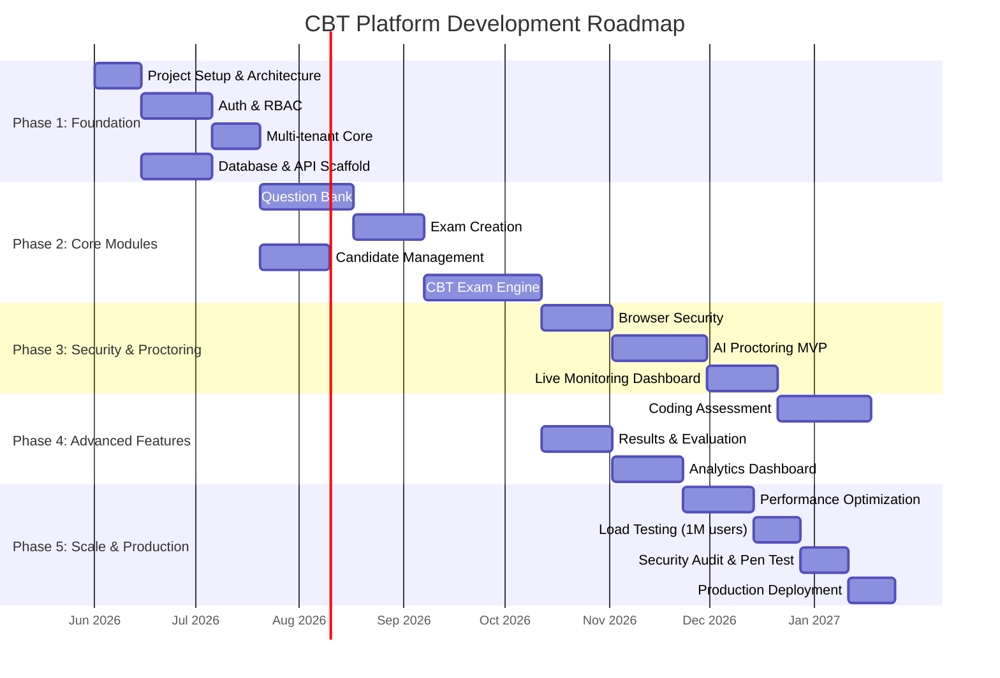

# 15. Development Roadmap

## Phase Overview

## Phase 1: Foundation (Weeks 1-7)

### Sprint 1-2: Project Setup
- [x] Monorepo structure (pnpm workspaces)
- [x] Architecture documentation
- [x] Prisma schema design
- [x] NestJS project scaffold
- [x] Next.js project scaffold
- [x] Docker Compose dev environment
- [x] CI pipeline (lint, test, build)
- [x] Shared types package

### Sprint 3-4: Authentication & RBAC
- [ ] JWT authentication (access + refresh tokens)
- [ ] MFA with TOTP
- [ ] Device fingerprinting
- [ ] Session management
- [ ] Login history
- [ ] RBAC guards and decorators
- [ ] Password recovery flow
- [ ] Rate limiting on auth endpoints

### Sprint 5: Multi-Tenant Core
- [ ] Tenant creation and management
- [ ] Tenant context middleware
- [ ] Schema-per-tenant isolation
- [ ] White-label branding configuration
- [ ] Custom domain support

**Milestone:** Admin can create tenants, users can authenticate with MFA

## Phase 2: Core Modules (Weeks 8-19)

### Sprint 6-7: Question Bank
- [ ] CRUD for all 8 question types
- [ ] Topic hierarchy and tagging
- [ ] Question versioning
- [ ] Approval workflow
- [ ] Bulk import (Excel, JSON)
- [ ] Full-text search
- [ ] Media upload (audio, video, images)

### Sprint 8-9: Exam Creation
- [ ] Exam templates
- [ ] Section management
- [ ] Question assignment and randomization
- [ ] Question pools
- [ ] Scheduling with timezone support
- [ ] Candidate group assignment
- [ ] Negative marking configuration
- [ ] Security policy per exam

### Sprint 10: Candidate Management
- [ ] Candidate registration
- [ ] Profile management
- [ ] Document upload
- [ ] KYC workflow
- [ ] Admit card generation (PDF)
- [ ] Bulk candidate import
- [ ] Candidate dashboard

### Sprint 11-13: CBT Exam Engine
- [ ] Exam session lifecycle
- [ ] Question navigation and palette
- [ ] Auto-save (REST + WebSocket)
- [ ] Mark for review
- [ ] Section-wise timing
- [ ] Auto-submit on timeout
- [ ] Offline recovery (IndexedDB)
- [ ] Multi-language support
- [ ] Accessibility (WCAG 2.1 AA)

**Milestone:** End-to-end exam flow without proctoring

## Phase 3: Security & Proctoring (Weeks 20-29)

### Sprint 14-15: Browser Security
- [ ] Fullscreen enforcement
- [ ] Copy/paste/right-click blocking
- [ ] DevTools detection
- [ ] Tab switch detection
- [ ] Print blocking
- [ ] Watermarking
- [ ] VM/VPN detection
- [ ] IP restriction and geofencing

### Sprint 16-17: AI Proctoring MVP
- [ ] WebRTC camera/mic integration
- [ ] Face detection service
- [ ] Face verification (pre-exam)
- [ ] Multiple face detection
- [ ] Risk scoring engine
- [ ] Proctoring event storage
- [ ] Basic eye tracking

### Sprint 18: Live Monitoring
- [ ] WebSocket monitoring dashboard
- [ ] Real-time candidate grid
- [ ] Violation alert feed
- [ ] Proctor intervention actions
- [ ] Exam statistics panel

**Milestone:** Proctored exam with live monitoring

## Phase 4: Advanced Features (Weeks 30-39)

### Sprint 19-20: Coding Assessment
- [ ] Monaco Editor integration
- [ ] Code execution sandbox (6 languages)
- [ ] Test case management
- [ ] Hidden test case execution
- [ ] Plagiarism detection integration

### Sprint 21: Results & Evaluation
- [ ] Auto-evaluation engine
- [ ] Manual evaluation interface
- [ ] Rank and percentile calculation
- [ ] Cutoff management
- [ ] Result publishing workflow
- [ ] Scorecard and certificate generation

### Sprint 22: Analytics
- [ ] Exam analytics dashboard
- [ ] Question analytics (difficulty index)
- [ ] Candidate performance analytics
- [ ] Proctoring analytics
- [ ] Organization-level reports
- [ ] Export (PDF, CSV)

**Milestone:** Full-featured platform ready for pilot

## Phase 5: Scale & Production (Weeks 40-47)

### Sprint 23: Performance
- [ ] Database query optimization
- [ ] Redis caching layer
- [ ] CDN configuration
- [ ] Connection pooling (PgBouncer)
- [ ] WebSocket horizontal scaling
- [ ] API response compression

### Sprint 24: Load Testing
- [ ] k6 load test scripts
- [ ] 100K concurrent user test
- [ ] 500K concurrent user test
- [ ] 1M concurrent user test
- [ ] Bottleneck identification and fixes

### Sprint 25: Security Audit
- [ ] OWASP ZAP automated scan
- [ ] Manual penetration testing
- [ ] Dependency vulnerability audit
- [ ] Security remediation

### Sprint 26: Production Launch
- [ ] AWS infrastructure provisioning (Terraform)
- [ ] Kubernetes production deployment
- [ ] Monitoring and alerting setup
- [ ] Runbook documentation
- [ ] Pilot exam with 10K users

**Milestone:** Production-ready platform

## Team Structure (Recommended)

| Role | Count | Phase |
|------|-------|-------|
| Tech Lead / Architect | 1 | All |
| Backend Developers | 3-4 | All |
| Frontend Developers | 2-3 | All |
| ML Engineer | 1-2 | Phase 3+ |
| DevOps Engineer | 1-2 | All |
| QA Engineer | 2 | Phase 2+ |
| UI/UX Designer | 1 | Phase 1-2 |
| Product Manager | 1 | All |
| Security Engineer | 1 | Phase 3+ |

## Risk Mitigation

| Risk | Impact | Mitigation |
|------|--------|------------|
| AI proctoring accuracy | High | Multiple model ensemble, human review fallback |
| 1M concurrent scaling | Critical | Early load testing, horizontal scaling design |
| Exam-day failure | Critical | Multi-AZ, auto-failover, offline recovery |
| Data breach | Critical | Encryption, audit logs, pen testing |
| Regulatory compliance | High | GDPR/ISO design from day 1, legal review |
