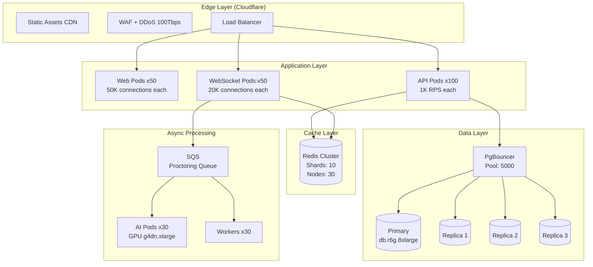

# 16. Scalability Strategy

## Target: 1,000,000 Concurrent Users

### Load Assumptions

| Metric | Value | Calculation |
|--------|-------|-------------|
| Concurrent users | 1,000,000 | Peak exam day |
| Answers saved/min | 5,000,000 | 1 save per 12 sec per user |
| Proctoring frames/min | 30,000,000 | 1 frame per 2 sec per user |
| WebSocket connections | 1,000,000 | 1 per active candidate |
| API requests/sec | 83,000 | Saves + heartbeats + navigation |
| Database writes/sec | 83,000 | Answer saves (primary bottleneck) |

## Scaling Architecture



## Horizontal Scaling Strategies

### 1. API Layer

| Strategy | Implementation |
|----------|----------------|
| Stateless pods | No in-memory state, all in Redis/DB |
| Auto-scaling | HPA on CPU (70%) + custom metric (RPS) |
| Connection pooling | PgBouncer transaction mode, 100 connections/pod |
| Response caching | Redis cache for exam config, question metadata |
| Read replicas | Route reads to 3 replicas, writes to primary |

### 2. WebSocket Layer

| Strategy | Implementation |
|----------|----------------|
| Redis adapter | Socket.IO Redis adapter for cross-pod events |
| Sticky sessions | ALB sticky sessions for WebSocket upgrade |
| Connection limits | 20K connections per pod, 50 pods = 1M |
| Event batching | Batch proctoring events before AI processing |
| Room sharding | Split monitoring rooms at 10K candidates |

### 3. Database Layer

| Strategy | Implementation |
|----------|----------------|
| Write optimization | Batch answer saves (buffer 5s, flush) |
| Partitioning | Partition session_responses by exam_id hash |
| Connection pooling | PgBouncer: 5000 connections → 200 DB connections |
| Read scaling | 3 read replicas for analytics, monitoring queries |
| Exam-day tables | Pre-create partitioned tables for exam day |

### 4. Caching Strategy

```typescript
const cacheConfig = {
  // Hot data - exam day
  'exam:config:{examId}': { ttl: 3600, strategy: 'write-through' },
  'exam:questions:{examId}': { ttl: 3600, strategy: 'write-through' },
  'session:state:{sessionId}': { ttl: 300, strategy: 'write-behind' },
  
  // Warm data
  'user:permissions:{userId}': { ttl: 900, strategy: 'cache-aside' },
  'tenant:config:{tenantId}': { ttl: 1800, strategy: 'cache-aside' },
  
  // Session data
  'auth:session:{sessionId}': { ttl: 900, strategy: 'write-through' },
  'auth:refresh:{tokenHash}': { ttl: 604800, strategy: 'write-through' },
};
```

### 5. Answer Save Optimization

```
Client auto-save (every 5s)
    │
    ▼
WebSocket → API Pod
    │
    ├── Write to Redis (immediate, < 5ms)
    │   session:{id}:responses → JSON blob
    │
    └── Async flush to PostgreSQL (every 30s batch)
        via Redis Stream consumer
        UPSERT session_responses (batch of 100)
```

This reduces DB writes from 83K/sec to ~2.8K/sec.

## Proctoring Scale Strategy

| Component | Scale | Notes |
|-----------|-------|-------|
| Frame ingestion | 30M frames/min | WebSocket → SQS queue |
| AI inference | 500K frames/min | 30 GPU pods, batch size 32 |
| Risk scoring | 500K scores/min | CPU-only, 10 worker pods |
| Snapshot storage | 6M snapshots/hour | Async S3 upload, 50 upload workers |
| Dashboard updates | 1K proctors | Redis pub/sub, 1 update/sec per exam |

**Key insight:** Not all 1M frames need real-time AI analysis. Strategy:
- 100% of candidates: browser event monitoring (tab switch, copy, etc.)
- 100% of candidates: face presence check (lightweight, CPU)
- 20% random sample: full AI analysis (face match, eye tracking, phone)
- 100% flagged candidates: continuous full AI analysis

## Cost Optimization

| Resource | On-Demand (Exam Day) | Baseline (Normal) | Savings |
|----------|---------------------|-------------------|---------|
| API Pods | 100 | 3 | Auto-scale down |
| GPU Pods | 30 | 0 | Spot instances |
| RDS | db.r6g.8xlarge | db.r6g.xlarge | Scheduled scaling |
| Redis | 30 nodes | 3 nodes | Cluster auto-scale |

**Estimated exam-day cost (1M users, 3-hour exam):** ~$15,000-25,000

## Performance Benchmarks (Target)

| Operation | Target Latency | Strategy |
|-----------|---------------|----------|
| Login | < 500ms | Redis session cache |
| Exam start | < 1s | Pre-cached exam config |
| Answer save | < 100ms | Redis write-behind |
| Question load | < 200ms | CDN + Redis cache |
| Proctoring frame | < 500ms | Async queue + GPU batch |
| Dashboard update | < 1s | Redis pub/sub |
| Result calculation | < 5min (100K candidates) | Parallel worker evaluation |

## Chaos Engineering

Pre-production resilience testing:

1. **Pod failure:** Kill random API pods during load test → zero downtime expected
2. **DB failover:** Promote read replica → < 30s failover
3. **Redis failure:** Single node failure → automatic failover
4. **Network partition:** Client offline → IndexedDB recovery
5. **GPU pod failure:** Proctoring degrades to browser-only monitoring
